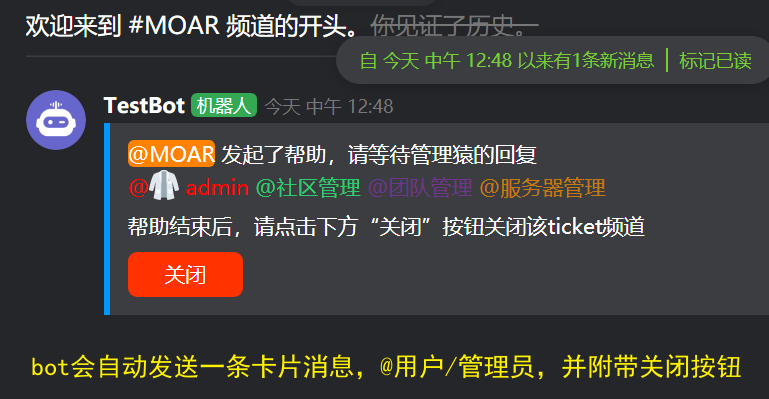
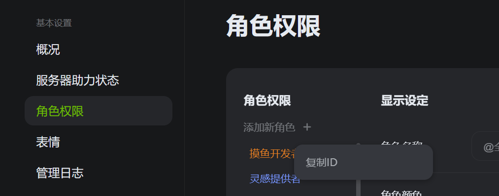
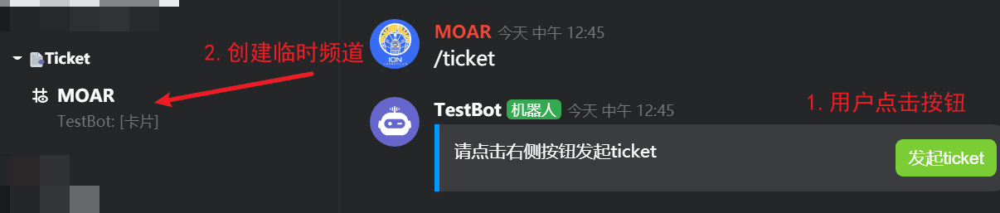
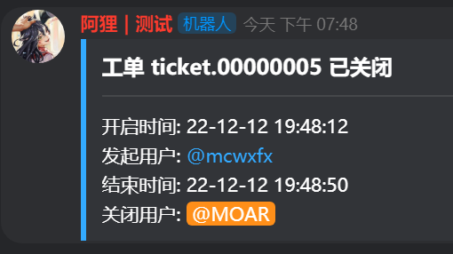
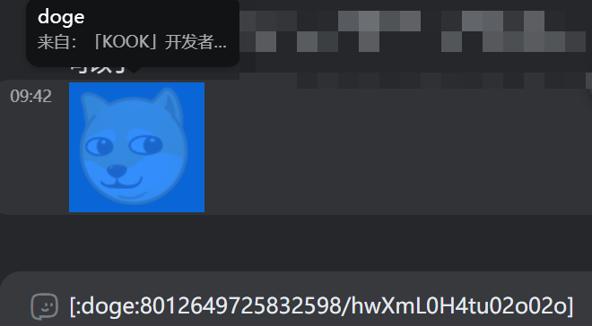
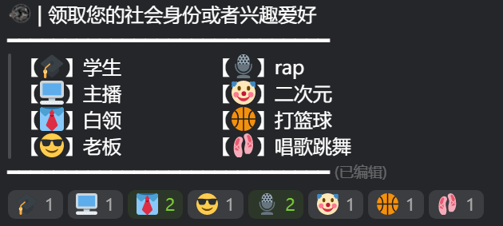
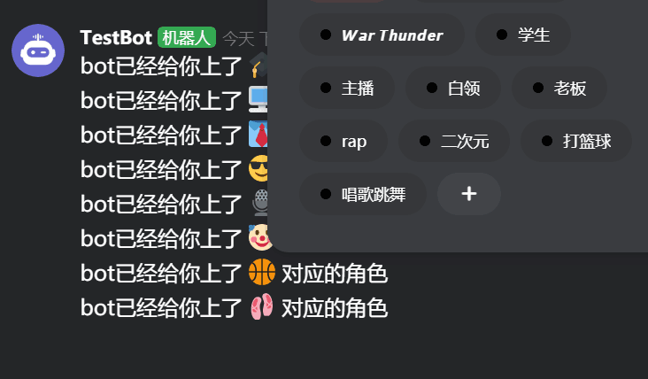

# Kook-Ticket-Bot
A ticket bot for KOOK 表单系统机器人

工作流程
* 当用户B点击卡片消息的按钮后，创建一个只有用户B可见的文字频道
* Bot会自动在该临时频道发送一条消息，并`@用户B` 和处理表单的 `@管理员`
* 当处理完毕后，点击`关闭`按钮，Bot会删除该文字频道

附加功能
* 通过表情回应给用户添加对应角色
* 设置bot动态 `游戏/音乐`

## Requerments

使用本机器人之前，请先确认您的python版本高于`3.7`, 安装以下依赖项

```
pip install -r reqiurements.txt
```

完成下方的配置后，就可以运行bot了 (注意 工作路径是code目录)

```
python main.py
```
如果是linux系统需要bot后台运行，使用如下命令

```
nohup python -u main.py >> ./log/bot.log 2>&1 &
```


## Config

因为bot开机的时候就会打开下面的文件，若缺少字段，会影响bot的正常运行

### 1.bot token
在 `code/config`路径中添加`config.json`，并在里面填入以下内容来初始化你的Bot

```json
{
    "token": "kook-bot websocket token"
}
```

### 2.TicketConfig

在 `code/config`路径中新增`TicketConf.json`，并填入以下内容（注意，这里的键值都不能修改）

```json
{
  "guild_id":"ticket bot 所服务的服务器id",
  "ticket": {
    "admin_role": [
      "管理员角色id 1",
      "管理员角色id 2"
    ],
    "category_id": "隐藏掉的频道分组id",
    "channel_id": {},
    "log_channel": "用于发送ticket日志的文字频道id",
    "debug_channel": "用于发送bot出错信息的文字频道id"
  }
}
```
ticket机器人需要您创建一个对全体成员不可见的隐藏分组，设置该分组权限为`@全体成员->分组不可见`来隐藏；并给管理员角色设置权限，让管理员能看到这个分组。

`admin_role`中的管理员角色，即为机器人发送的ticket消息中会`@`的角色组；且只有拥有管理员身份组的用户，才能`关闭ticket/给ticket写评论`。



#### 关于命令权限问题

> id获取办法：`kook设置-高级设置-打开开发者模式`；右键服务器头像，复制服务器id；右键用户头像即可复制用户id，右键频道/分组即可复制频道/分组id。

只有拥有`admin_role`中角色的用户才能操作bot的管理命令。

举例：服务器有个`摸鱼`角色，如果你想让**张三**可以操作bot的管理命令，那就需要给**张三**添加上`摸鱼`角色，并进入服务器的设置-角色管理-右键`摸鱼`角色，复制角色id，并把这个id添加到`"admin_role"`中



假设`摸鱼`的角色id为114514，那么添加了之后的`TicketConf.json`配置文件应该如下

```json
{
  "guild_id":"ticket bot 所服务的服务器id",
  "ticket": {
    "admin_role": [
      "114514"
    ],
    "category_id": "隐藏掉的频道分组id",
    "channel_id": {},
    "log_channel": "用于发送ticket日志的文字频道id",
    "debug_channel": "用于发送bot出错信息的文字频道id"
  }
}
```
这样才能让**张三**操作`/ticket`命令


### 3.TicketLog

在 `code/log` 路径中新增 `TicketLog.json`，并填入以下字段

```json
{
    "TKnum": 0,
    "data": {},
    "msg_pair": {},
    "TKchannel": {}
}
```

* TKnum是ticket的编号计数，最高为8位数字，应该完全够用了
* TKchannel是用于记录bot创建的ticket频道id，和ticket编号对应
* msg_pair是一个键值对，用于记录bot在ticket频道发送的消息（关闭按钮），和ticket编号对应
* data中是每一个编号的ticket的详细信息，包括开启时间、开启用户、关闭时间、关闭用户、管理员的评论等

### 4.TicketMsgLog

在 `code/log` 路径中新增 `TicketMsgLog.json`，并填入以下字段

```json
{
  "TKMsgChannel": {},
  "data": {}
}
```
* TKMsgChannel是用于记录bot创建的ticket频道id，和ticket编号对应，用来判断ticket频道是否有过消息（避免出现没有发过消息就关闭ticket频道的情况）
* data为消息记录，作为ticket频道的消息记录

为了保存聊天记录，还需要创建 `code/log/ticket` 文件夹，bot会在ticket关闭后，按照编号，保存 `code/log/ticket/编号.json` 文件，并删除 `TicketMsgLog.json` 中 `data` 字段里面的内容。

- [ ] 后续会增加bot发送聊天记录文件到频道的功能

----

#### 下面是ticket功能的示例图

用户先点击按钮，机器人会创建一个临时频道



并在该频道内部发送一条消息，并at用户和管理员，附带一个只有管理员才能关闭的按钮


ticket被关闭后，bot会向`TicketConf.json`中设置的log频道发送一张卡片



管理员用户可以使用`/tkcm`命令，给某个ticket添加备注信息，卡片消息会同步更新

```
/tkcm TICKET编号 备注内容
示例
/tkcm 00000000 这是一个测试
```


----

### emoji/role

这个功能的作用是根据一条消息的表情回应，给用户上对应的角色。类似于YY里的上马甲。

要想使用本功能，请在 `code/TicketConf.json` 里面追加如下字段

```json
  "emoji": {
    "乱写一个字符串，以后不要修改": {
      "channel_id": "该消息的频道id",
      "data": {},
      "msg_id": "消息id"
    }
  }
```
随后要做的是，在`data`里面添加emoji和角色id的对照表

> 角色ID获取：设置内开启开发者模式后，进入服务器后台，右键角色复制id；
>
> 表情ID获取：
> * 在客户端内，选中表情后`ctrl+c`，即可复制出表情id
> * 在bot的代码中，打印[add_reaction的event消息](https://github.com/musnows/Kook-Ticket-Bot/blob/296f3bf477b8d5530934464fc7f8489d18c65379/code/main.py#L447-L452)获取表情id



配置示例如下，左侧为表情，右侧为这个表情对应的角色id

```json
  "emoji": {
    "乱写一个字符串，以后不要修改": {
      "channel_id": "该消息的频道id",
      "data": {
        "❤": "3970687",
        "🐷": "2881825",
        "👍": "0",
        "💙": "2928540",
        "💚": "2904370",
        "💛": "2882418",
        "💜": "2907567",
        "🖤": "4196071"
      },
      "msg_id": "消息id"
    }
  }
```
如果你有多个消息（比如不同的角色逻辑），那就在后续追加字段

```json
  "emoji": {
    "乱写一个字符串A，以后不要修改": {
      "channel_id": "该消息的频道id",
      "data": {
        "❤": "3970687",
        "🐷": "2881825",
        "👍": "0",
        "💙": "2928540",
        "💚": "2904370",
        "💛": "2882418",
        "💜": "2907567",
        "🖤": "4196071"
      },
      "msg_id": "消息id"
    },
    "乱写一个字符串B，以后不要修改": {
      "channel_id": "该消息的频道id",
      "data": {},
      "msg_id": "消息id"
    }
  }
```

bot会根据`emoji_id`给用户上对应的角色






## The end
有任何问题，请添加`issue`，或加入我的交流服务器与我联系 [kook邀请链接](https://kook.top/gpbTwZ)

如果你觉得本项目还不错，还请高抬贵手点个star✨，万般感谢！
