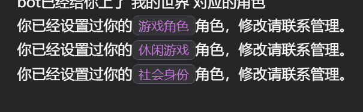

# Kook-Ticket-Bot
A ticket bot for KOOK 表单系统机器人

工作流程
* 当用户B点击卡片消息的按钮后，创建一个只有用户B可见的文字频道
* Bot会自动在该临时频道发送一条消息，并`@用户B` 和处理表单的 `@管理员`
* 当处理完毕后，点击`关闭`按钮，Bot会删除该文字频道

附加功能
* 通过表情回应给用户添加对应角色
* 设置bot动态 `游戏/音乐`

## Requerments

使用本机器人之前，请先安装以下依赖项

```
pip install khl.py
pip install requests
```

## Config

因为bot开机的时候就会打开下面的文件，若缺少字段，会影响bot的正常运行

### 1.bot token
在 `code/config`路径中添加`config.json`，并在里面填入以下内容来初始化你的Bot

```json
{
    "token": "kook-bot websocket token",
    "verify_token": "",
    "encrypt_key": ""
}
```

### 2.TicketConfig

在 `code/config`路径中新增`TicketConf.json`，并填入以下内容

```json
{
  "admin_role": [
    "管理员角色id 1",
    "管理员角色id 2"
  ],
  "admin_user": [
    "管理员用户id 1",
    "管理员用户id 2"
  ],
  "category_id": "隐藏掉的频道分组id",
  "channel_id": {},
  "log_channel": "用于发送ticket日志的文字频道id",
  "debug_channel": "用于发送bot出错信息的文字频道id"
}
```
ticket机器人需要您创建一个对全体成员不可见的隐藏分组，设置该分组权限为`@全体成员->分组不可见`来隐藏

> id获取办法：`kook设置-高级设置-打开开发者模式`；右键用户头像即可复制用户id，右键频道/分组即可复制id，角色id需要进入服务器管理面板的角色页面中右键复制

### 3.TicketLog

在 `code/log` 路径中新增 `TicketLog.json`，并填入以下字段

```json
{
    "TKnum": 0,
    "data": {},
    "msg_pair": {},
    "TKchannel": {}
}
```

* TKnum是ticket的编号计数，最高为8位数字，应该完全够用了
* TKchannel是用于记录bot创建的ticket频道id，和ticket编号对应
* msg_pair是一个键值对，用于记录bot在ticket频道发送的消息（关闭按钮），和ticket编号对应
* data中是每一个编号的ticket的详细信息，包括开启时间、开启用户、关闭时间、关闭用户、管理员的评论等

### 4.TicketMsgLog

在 `code/log` 路径中新增 `TicketMsgLog.json`，并填入以下字段

```json
{
  "TKMsgChannel": {},
  "data": {}
}
```
* TKMsgChannel是用于记录bot创建的ticket频道id，和ticket编号对应，用来判断ticket频道是否有过消息（避免出现没有发过消息就关闭ticket频道的情况）
* data为消息记录，作为ticket频道的消息记录

为了保存聊天记录，还需要创建 `code/log/ticket` 文件夹，bot会在ticket关闭后，按照编号，保存 `编号.json` 文件，并删除 `TicketMsgLog.json` 中 `data` 字段里面的内容

----

#### 下面是ticket功能的示例图

用户先点击按钮，机器人会创建一个临时频道


并在该频道内部发送一条消息，并at用户和管理员，附带一个只有管理员才能关闭的按钮


ticket被关闭后，bot会向`TicketConf.json`中设置的log频道发送一张卡片


管理员用户可以使用`/tkcm`命令，给某个ticket添加备注信息，卡片消息会同步更新

```
/tkcm TICKET编号 备注内容
示例
/tkcm 00000000 这是一个测试
```


----

### emoji/role

>这个功能写的很烂。虽然能用，但效率很低，后续会重写

如果你想使用通过表情回应来上角色的功能，则还需要添加 `code/config/emoji.txt`

举个栗子：emoji_id 🎙 对应 role_id `4779921`，则需要在`emoji.txt`中写入下面内容
```
🎙:4779921
```
bot会根据emoji_id给用户上对应的角色


看`L109-113`，我设置了3个不同的 Msg_ID 给 `add_reaction event`，因为需要设置不同分类的角色
```
# 设置自动上色event的服务器id和消息id
Guild_ID = '1573724356603748'
Msg_ID_1 = '0a4b9403-de0b-494e-b216-3d1dbe957d0f'
Msg_ID_2 = '5d92f952-15c1-46a4-b370-41a9cf739e50'
Msg_ID_3 = 'd4dbb164-bd80-469b-9473-8285a9c91e0d'
```
对应的，判断函数也被分为了3个不同的情况。你可以根据你的实际需要修改/弃用一部分代码。

同时，`L115-170`则是3个不同的idsave文件，用来保存已经领取过角色的用户。这样设计可以让每一个用户只能在一个Msg_ID下领取其中一个角色。避免刷角色的情况。



>更多代码示例，请查看`code/main.py` 的 `L192-L270`

## The end
有任何问题，请添加`issue`，或加入我的交流服务器与我联系 [kook邀请链接](https://kook.top/gpbTwZ)

如果你觉得本项目还不错，还请高抬贵手点个star✨，万般感谢！