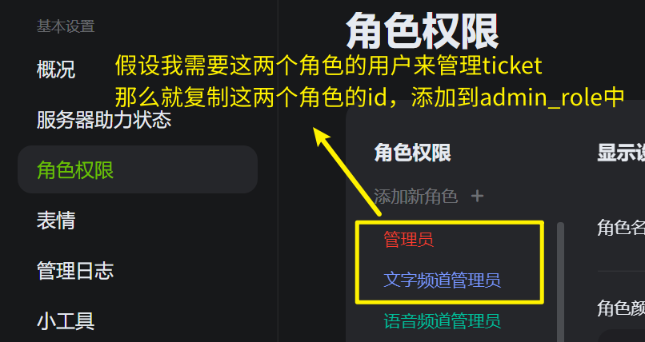
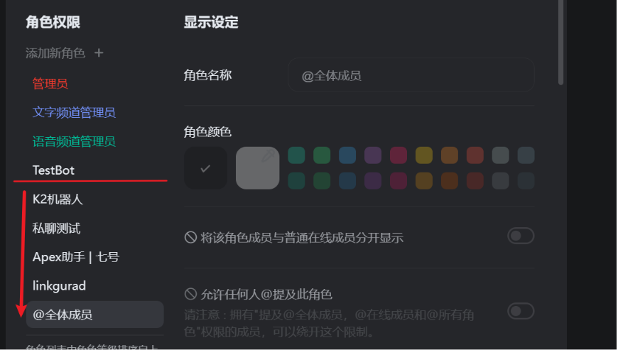

# Kook-Ticket-Bot

 


A ticket bot for KOOK, **自托管**表单/工单系统机器人

工作流程
* 当用户B点击卡片消息的按钮后，创建一个只有用户B可见的文字频道
* Bot会自动在该临时频道发送一条消息，并`@用户B` 和处理表单的 `@管理员`
* 当处理完毕后，点击`关闭`按钮，Bot会删除该文字频道
* 文字频道删除后，Bot会给预先`设置好的log频道`和`开启ticket的用户`发送一条记录信息，并在服务器后端保存该ticket的聊天记录；
* 管理员可以使用`/tkcm`命令，指定ticket编号对该工单发表评论

附加功能
* 通过表情回应给用户添加对应角色
* 设置Bot动态 `游戏/音乐`

本README尽量详细，争取让没有写过python代码，但了解基本编程环境搭建的用户能配置成功并正常使用bot！

> 无须服务器和环境搭建，在replit上部署本bot！[WIKI教程](https://github.com/musnows/Kook-Ticket-Bot/wiki)

如果您对本README还有完善的建议，十分欢迎您[加入KOOK帮助频道](https://kook.top/gpbTwZ)与我联系，亦或者在仓库提出issue

## help command

Bot的帮助命令为 `/tkhelp`

主要配置项均在配置文件中，后文有提及。

## Requerments

使用本机器人之前，请先确认您的python版本高于`3.9`, 安装以下依赖项

```
pip install -r reqiurements.txt
```

完成下方的配置后，就可以运行bot了 (注意 工作路径是code目录)

```
python main.py
```
如果是linux系统需要bot后台运行，使用如下命令

```
nohup python -u main.py >> ./log/bot.log 2>&1 &
```


## Config

因为bot开机的时候就会打开下面的文件，若缺少字段，会影响bot的正常运行；

目前在 [code/utils.py](./code/utils.py) 的底部打开了所有的配置文件，并添加了 `create_logFile()` 函数来自动创建不存在的配置文件，以下README中对配置文件的示例仅供参考，若运行后出现了自动创建文件失败的报错，请采用REAMDE中的描述手动创建配置文件！

### 1.bot token
在 `code/config`路径中添加`config.json`，并在里面填入以下内容来初始化你的Bot

```json
{
    "token":"bot webhook token",
    "verify_token":"bot webhook verify token",
    "encrypt":"bot webhook encrypt token",
}
```

使用webhook方式会开启一个回调地址，该操作需要有公网ip的机器才能进行。如果你的机器人部署在无法外网访问的机器上，请采用websocket链接方式。

开头有两种方式启动机器人的代码，根据需要，注释掉另外一个即可（比如我需要webhook，那就注释掉websocket的）

修改代码后，记得在kook机器人管理后台修改机器人的链接配置。

```python
# bot = Bot(token=Botconf['token']) # websocket
bot = Bot(cert=Cert(token=Botconf['token'], verify_token=Botconf['verify_token'],encrypt_key=Botconf['encrypt']),port=5000)# webhook
```

如果采用webhook的连接方式（replit部署请采用此方式，方便机器人保活）需要在机器人后台填写回调地址（Callback Url）

```bash
# 默认情况下（记得开放服务器对应端口的防火墙）
http://公网ip:5000/khl-wh
# 如果是replit部署的，会给你提供一个url
replit-url/khl-wh
```
填写之后，点击`重试`按钮，测试webhook是否正常。如果显示`配置已保存`，那就是ok了！

如果多次失败，请加入帮助频道咨询or采用websocket链接方式。


### 2.TicketConfig

在 `code/config`路径中新增`TicketConf.json`，并填入以下内容（注意，这里的键值都不能修改）

```json
{
  "guild_id":"ticket bot 所服务的服务器id",
  "ticket": {
    "master_id":"管理员用户id",
    "admin_role": [
      "管理员角色id 1",
      "管理员角色id 2"
    ],
    "category_id": "隐藏掉的频道分组id",
    "channel_id": {},
    "log_channel": "用于发送ticket日志的文字频道id",
    "debug_channel": "用于发送bot出错信息的文字频道id"
  }
}
```
ticket机器人需要您创建一个对全体成员不可见的隐藏分组，设置该分组权限为`@全体成员->分组不可见`来隐藏；并给管理员角色设置权限，让管理员能看到这个分组。

`admin_role`中的管理员角色，即为机器人发送的ticket消息中会`@`的角色组；且只有拥有管理员身份组的用户，才能`关闭ticket/给ticket写评论`。


目前机器人新增了单频道管理员配置，源于不同频道的ticket按钮，可以通知不同的管理员用户

* 频道A和B都有ticket按钮
* 在频道A执行 `/aar @角色甲` 的命令，会将角色甲添加入频道A ticket的管理员中
* 此时用户点击频道A的ticket按钮，机器人会 @全局管理员 (配置文件`TicketConf["ticket"]["admin_role"]`中的管理员) 和 @角色甲
* 点击B的ticket按钮，只会 @全局管理员
* 如果想添加**全局管理员**，命令为 `/aar @角色乙 -g`

如果不想要全局管理员，配置文件中`"admin_role"`可以留空。此时只有 `master_id` 用户可以执行机器人管理命令，添加单频道管理员。

#### 关于命令权限问题

> id获取办法：`kook设置-高级设置-打开开发者模式`；右键服务器头像，复制服务器id；右键用户头像即可复制用户id，右键频道/分组即可复制频道/分组id。

只有拥有`admin_role`中角色的用户才能操作bot的管理命令。

举例：服务器有个`摸鱼`角色，如果你想让**张三**可以操作bot的管理命令，那就需要给**张三**添加上`摸鱼`角色，并进入服务器的设置-角色管理-右键`摸鱼`角色，复制角色id，并把这个id添加到`"admin_role"`中。

注意：`/aar` 命令设置的单频道管理员无法执行ticket命令



假设`摸鱼`的角色id为114514，那么添加了之后的 `TicketConf.json` 配置文件应该如下

```json
{
  "guild_id":"ticket bot 所服务的服务器id",
  "ticket": {
    "admin_role": [
      "114514"
    ],
    "category_id": "隐藏掉的频道分组id",
    "channel_id": {},
    "log_channel": "用于发送ticket日志的文字频道id",
    "debug_channel": "用于发送bot出错信息的文字频道id"
  }
}
```
这样才能让**张三**操作`/ticket`命令


### 3.TicketLog

在 `code/log` 路径中新增 `TicketLog.json`，并填入以下字段

```json
{
    "TKnum": 0,
    "data": {},
    "msg_pair": {},
    "TKchannel": {}
}
```

* TKnum是ticket的编号计数，最高为8位数字，应该完全够用了
* TKchannel是用于记录bot创建的ticket频道id，和ticket编号对应
* msg_pair是一个键值对，用于记录bot在ticket频道发送的消息（关闭按钮），和ticket编号对应
* data中是每一个编号的ticket的详细信息，包括开启时间、开启用户、关闭时间、关闭用户、管理员的评论等

### 4.TicketMsgLog

在 `code/log` 路径中新增 `TicketMsgLog.json`，并填入以下字段

```json
{
  "TKMsgChannel": {},
  "data": {}
}
```
* TKMsgChannel是用于记录bot创建的ticket频道id，和ticket编号对应，用来判断ticket频道是否有过消息（避免出现没有发过消息就关闭ticket频道的情况）
* data为消息记录，作为ticket频道的消息记录

为了保存聊天记录，还需要创建 `code/log/ticket` 文件夹（机器人会自动创建）

bot会在ticket关闭后，按照编号，保存 `code/log/ticket/编号.json` 文件，并删除 `TicketMsgLog.json` 中 `data` 字段里面的内容。

----

#### 下面是ticket功能的示例图

用户先点击按钮，机器人会创建一个临时频道


并在该频道内部发送一条消息，并at用户和管理员，附带一个只有管理员才能关闭的按钮


ticket被关闭后，bot会向`TicketConf.json`中设置的log频道发送一张卡片


管理员用户可以使用`/tkcm`命令，给某个ticket添加备注信息，卡片消息会同步更新

```
/tkcm TICKET编号 备注内容
示例
/tkcm 00000000 这是一个测试
```


----

### 5.emoji/role

这个功能的作用是根据一条消息的表情回应，给用户上对应的角色。类似于YY里的上马甲。

请确认您的bot角色拥有管理员权限，并处于其需要给予的角色之上。如图，TestBot只能给其他用户上在他下面的角色，否则Api会报错 `无权限`



要想使用本功能，请创建 `code/log/ColorID.json`文件，复制如下内容到其中（新版本后，机器人会自动创建此文件）

```json
{
    "data":{}   
}
```

并在 `code/TicketConf.json` 里面追加如下字段

```json
  "emoji": {
    "乱写一个字符串，以后不要修改": {
      "channel_id": "该消息的频道id",
      "data": {},
      "msg_id": "消息id"
    }
  }
```
随后要做的是，在`data`里面添加emoji和角色id的对照表

> 角色ID获取：设置内开启开发者模式后，进入服务器后台，右键角色复制id；
>
> 表情ID获取：
> * 在客户端内，选中表情后`ctrl+c`，即可复制出表情id
> * 在bot的代码中，打印[add_reaction的event消息](https://github.com/musnows/Kook-Ticket-Bot/blob/296f3bf477b8d5530934464fc7f8489d18c65379/code/main.py#L447-L452)获取表情id


配置示例如下，左侧为表情，右侧为这个表情对应的角色id

```json
  "emoji": {
    "乱写一个字符串，以后不要修改": {
      "data": {
        "❤": "对应的角色id-1",
        "🐷": "对应的角色id-2",
        "💙": "对应的角色id-3",
        "👍": "0（对应的是全体成员的角色）",
      },
      "msg_id": "消息id"
    }
  }
```

如果你有多个消息（比如不同的角色逻辑），那就在后续追加字段

```json
  "emoji": {
    "乱写一个字符串A，以后不要修改": {
      "data": {
        "❤": "对应的角色id-1",
        "🐷": "对应的角色id-2",
        "💙": "对应的角色id-3",
        "👍": "0（对应的是全体成员的角色）",
      },
      "msg_id": "消息id A"
    },
    "乱写一个字符串B，以后不要修改": {
      "data": {},
      "msg_id": "消息id B"
    }
  }
```

如下，您需要自行编写一个对应的角色关系消息，然后右键复制该消息的消息id。
卡片消息可以用官方的 [卡片编辑器](https://www.kookapp.cn/tools/message-builder.html#/card) 编辑后发送


配置后，bot会根据配置文件中的`emoji:角色`对照表，给用户上对应的角色


### gaming/singing

这两个命令都是用于控制机器人在玩状态的。其中机器人的游戏状态已经写死了几个游戏。

使用如下代码，你可以创建一个你自己想要的游戏

```python
import requests

url = "https://www.kookapp.cn/api/v3/game/create"
botoken = "机器人 websocket token"
header={f'Authorization': f"Bot {botoken}"}
params ={
    "name":"游戏名",
    "icon":"游戏图标的url (可以将图片上传到kook后，点开大图，在右下角...处复制url)"
}
ret = requests.post(url,headers=header,data=params)
print(ret)
print(ret.text) # 返回值中有游戏的id
```

在最后的输出结果中，会包含游戏的id。关于此api字段的解释见[官方文档](https://developer.kookapp.cn/doc/http/game#%E6%B7%BB%E5%8A%A0%E6%B8%B8%E6%88%8F)

假设新增的游戏id为`12345`，那么就需要在`gaming`所在函数中，添加如下代码

~~~python
  if game == 10: # 自己设定一个执行命令时需要的编号
      ret = await status_active_game(12345) # xxx游戏的id
      await msg.reply(f"{ret['message']}，Bot上号xxx游戏啦！")
~~~

kook的在玩状态同步及其缓慢，请耐心等待。

## The end

有任何问题，请添加`issue`，或加入我的交流服务器与我联系 [kook邀请链接](https://kook.top/gpbTwZ)

如果你觉得本项目还不错，还请高抬贵手点个star✨，万般感谢！
